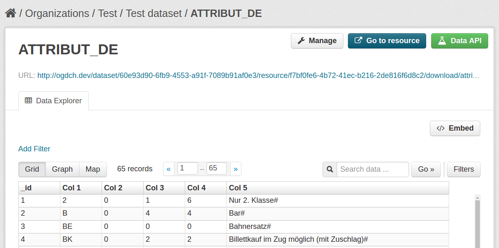

====================
ckanext-resourcecsv
====================

------------
Installation
------------

.. Add any additional install steps to the list below.
   For example installing any non-Python dependencies or adding any required
   config settings.

To install ckanext-resourcecsv:

1. Activate your CKAN virtual environment, for example::

     . /usr/lib/ckan/default/bin/activate

2. Install the ckanext-resourcecsv Python package into your virtual environment::

     pip install ckanext-resourcecsv

3. Add ``resourcecsv`` to the ``ckan.plugins`` setting in your CKAN
   config file (by default the config file is located at
   ``/etc/ckan/default/production.ini``).

4. Restart CKAN. For example if you've deployed CKAN with Apache on Ubuntu::

     sudo service apache2 reload

------------------------
Development Installation
------------------------

To install ckanext-resourcecsv for development, activate your CKAN virtualenv and
do::

    cd ckanext-resourcecsv
    python setup.py develop
    pip install -r dev-requirements.txt

---------------
Config Settings
---------------

Specify the schema file in the CKAN configuration::

    ## ResourceCSV plugin settings
    ckanext.resourcecsv.schemas.infoplus = ckanext.resourcecsv:infoplus.json

-----------------
The Schema File
-----------------

::

    {
      "ATTRIBUT_DE": [2,6,9,11],
      "ATTRIBUT_EN": [2,6,9,11],
      "ATTRIBUT_FR": [2,6,9,11],
      "ATTRIBUT_IT": [2,6,9,11],
      "BAHNHOF": [5,7],
      "BETRIEB_DE": [5,7],
      "BETRIEB_EN": [5,7],
      "BETRIEB_FR": [5,7],
      "BETRIEB_IT": [5,7],
      "BFKOORD": [8,20,29,35],
      "BFKOORD_GEO": [8,19,29,35],
      ...
    }

The keys are filenames to match.
The values are lists with column numbers.

For each uploaded file, the extension will check the uploaded file's filename against the keys in the schema.
If the key exists, the extension will
* inject the delimiter ";" at the specified column in each line, replacing the character that's already there
* save the the rewritten file to the /tmp folder
* upload the file to the dataset, with a '.csv' extension

-----------------
Running the Tests
-----------------

To run the tests, do::

    nosetests --nologcapture --with-pylons=test.ini

To run the tests and produce a coverage report, first make sure you have
coverage installed in your virtualenv (``pip install coverage``) then run::

    nosetests --nologcapture --with-pylons=test.ini --with-coverage --cover-package=ckanext.resourcecsv --cover-inclusive --cover-erase --cover-tests

